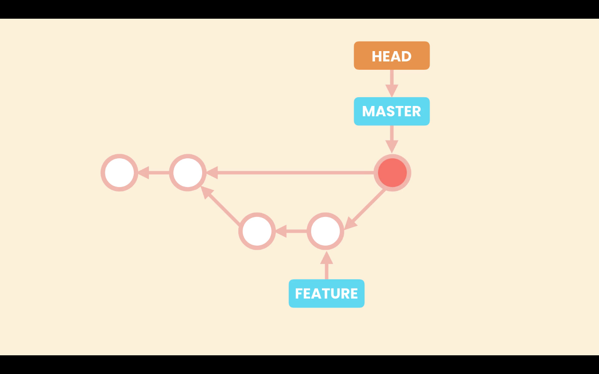
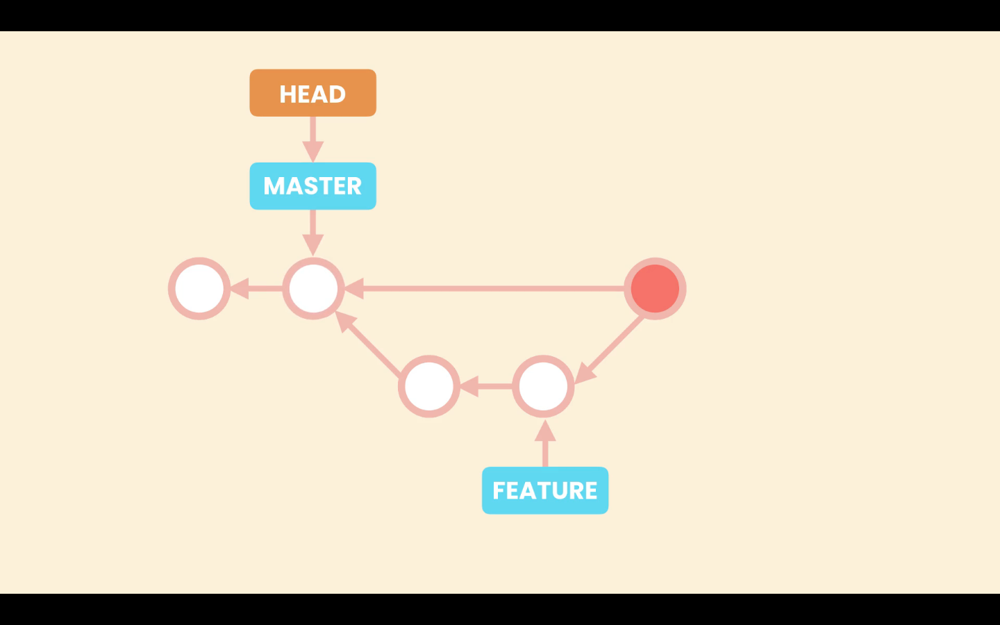
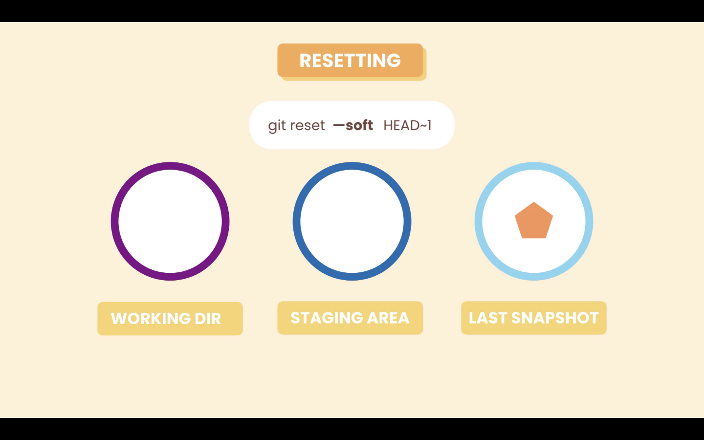
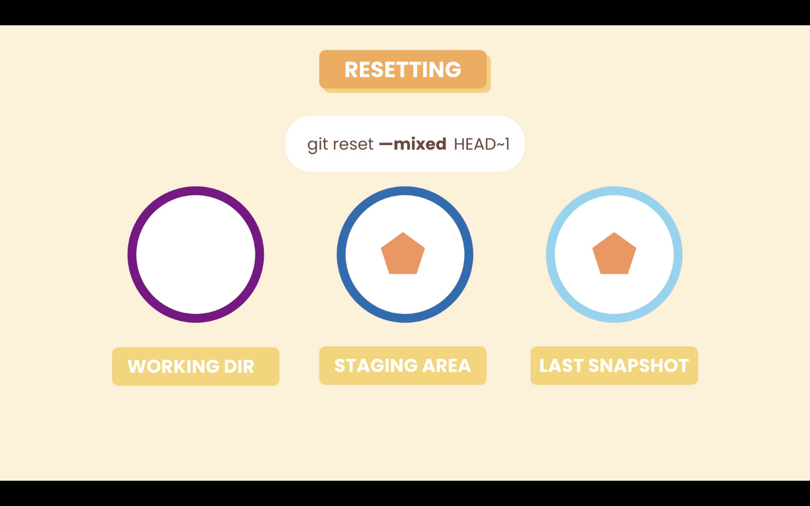
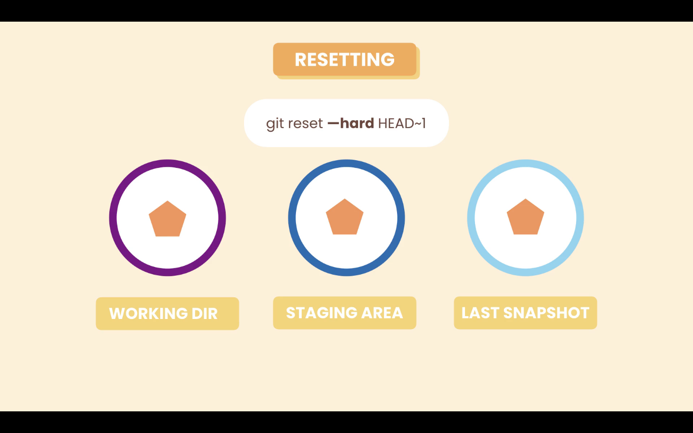

# 14- Undoing a Faulty Merge

In case we need to undo a merge we have two options:

1. git reset — rewrites history (dangerous for shared/pushed commits, others will have conflicts)
2. git revert — creates a new commit that undoes changes (safe for shared history)

## 1. Remove the merge commit

After a merge we have the **_`main`_** and **_`HEAD`_** pointers, pointing to the last commit, that is the merge commit.



With the reset command we will move both pointers to the last commit before the merge. And remove the merge commit.



Run the command:

```zsh
git reset --hard HEAD~1
```

After we run the command the merge commit does not have any commit or pointer pointing to it. So for Git this garbage, once in a while Git looks for commits like this and removes them.

### Resting the **_`HEAD`_** options

When resting the **_`HEAD`_** pointer, we have three option:

1. soft
2. mixed
3. hard

#### Option `--soft`

When we reset the **_`HEAD`_** using the `--soft` option, Git will have the **_`HEAD`_** pointer pointing to the indicated commit, in this case `HEAD~1`, so go back one commit, in the **_Repository_**. But the **_Staging Area_** and **_Working Directory_** are not affected.

```zsh
git reset --soft HEAD~1
```



#### Option `--mixed`

In this case Git is going to apply the new snapshot to both the **_Repository_** and **_Staging Area_**, local changes in the **_Working Directory_** will not be affected.

Using the `--mixed` option, which is the default option so we do not need to specify it.

```zsh
git reset HEAD~1
```



#### Option `--hard`

Using the `--hard` option Git will apply the new snapshot to all environments (**_Working Directory_**, **_Staging Area_**, **_Repository_**).This was the state we where before stating the merge.



## 2. Revert the merge commit

If we have shared our history instead of undoing the merge commit we have to revert the last commit.

A merge commit has two parents so have to tell git how we want to revert the changes. Because our merge commit is in the **_`main`_** branch the first parent should also be in the **_`main`_** branch. To do this we use the the following command:

```zsh
git revert -m 1 HEAD
```
```
main:   A → B → C --------→ M (merge commit)
                              ↑
bugfix:         C → D → E ───┘

M has two parents:
Parent 1 → C (last commit on main)
Parent 2 → E (last commit on bugfix)
```
So Git gets confused — "which side should I consider the mainline to revert to?"

> -m 1 tells Git — "parent 1 is the mainline" (which is the main branch)
> So Git reverts back to how main looked before the merge happened
> Effectively undoing all the bugfix changes that were merged in
> Running this Git will open the default editor with a default message for the revert commit.
