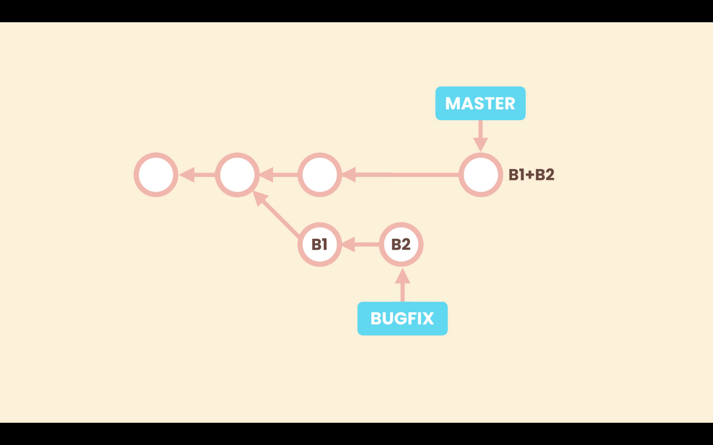

# 15- Squash Merging

In squash merging we first combine the commits from the branch, and then we merge. This is useful in situations where the commits in the branch are not good quality commits, or simply we do not need the history from the branch.

For example commits are

- To fined grain
- Maybe we have mixed different things in each commit



```
new-feature branch commits:
- "initial work"
- "fixed typo"
- "oops forgot this"
- "finally works"
- "code review fix"
- "another fix"
- "okay now it really works"
```

- These are messy, unnecessary, low quality commits that make no sense to anyone else.
- when you do a regular merge, all these ugly commits come into main:

```
main: A → B → C → "initial work" → "fixed typo" → 
      "oops forgot this" → "finally works" → ...
```
- This pollutes your main branch history and makes git log hard to read.
- It takes **all those messy commits** and squashes them into **one single clean commit** on main
```
git merge --squash new-feature
main: A → B → C → "added new feature"
```

This new commit is not a merge commit, because it does not have two parents. It is lacking the reference to **B2**, the last commit from the **bugfix** branch. It is just a regular commit added on top of ***`main`*** that combines the commits from the other branch.

When we delete the **bugfix** branch, we are left with a clean linear history. This is the benefit fo Squash merging. But usually we should only apply it to short lived branches with bad history.


To perform a squash merge use the following command `git merge --squash <branch-name>`.
> Git will take all the commits from the feature branch and combine them into a single set of changes and place them in the Staging Area. It will NOT automatically create a commit — we have to manually run git commit -m "your message" to create one clean commit on main.
```zsh
git merge --squash bugfix
```

## List merged and unmerged branches

If we run `git branch --merged`, to list all the merged branches we will not see the **bugfix** branch. Because this branch was not actually merged. So it best to delete it after the squash merge, but in this situation we have to use `-D` instead of `-d`, or Git will throw an error. So `git branch -D bugfix`.

## Conflict in Squash merge

In case we run into conflicts when running a Squash merge, we can resolve this conflicts as in a normal merge.
